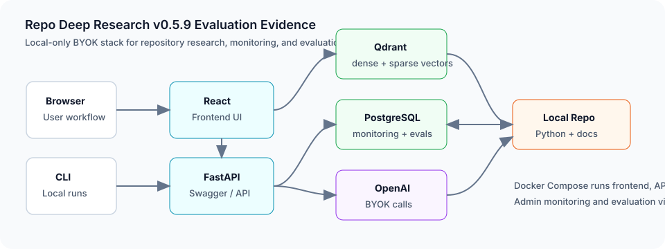
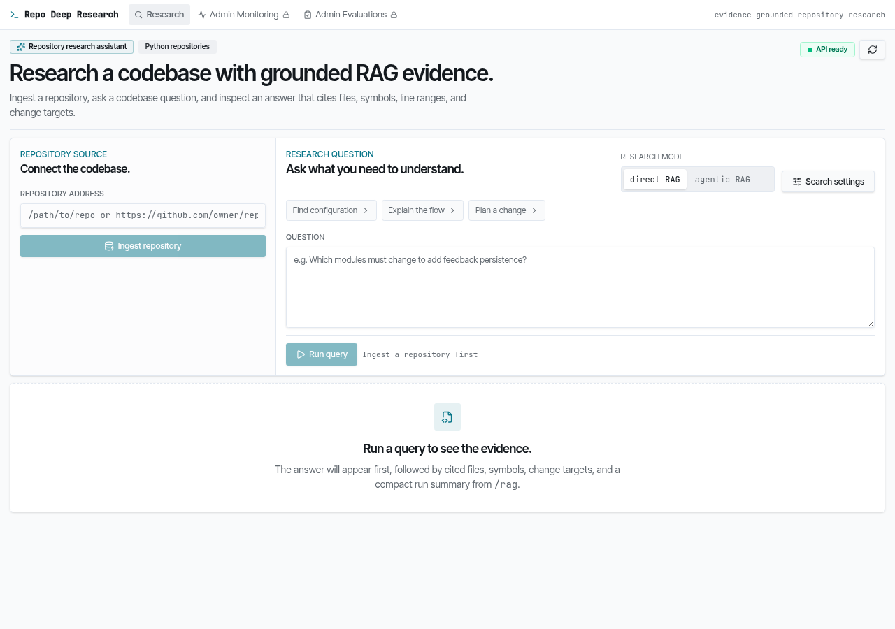
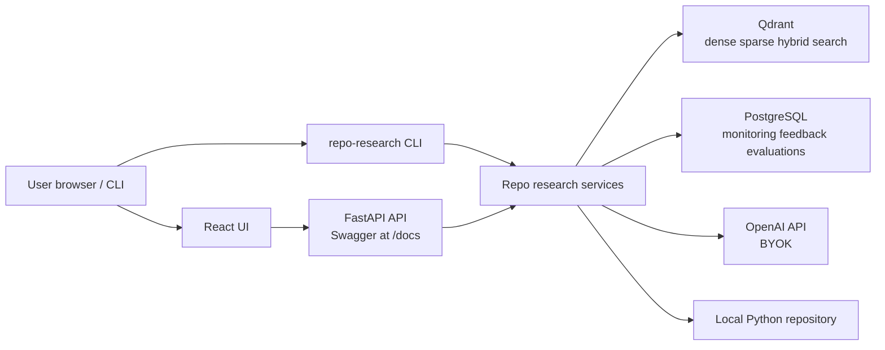

# Repo Deep Research

[](https://github.com/dosorio79/repo_deep_research/actions/workflows/ci.yml)
[](https://github.com/dosorio79/repo_deep_research/releases)
[](https://www.python.org/downloads/release/python-3120/)

Repo Deep Research is an evidence-grounded research tool for Python
repositories. It indexes source code and project documentation, retrieves
repository evidence, and answers questions about implementation locations,
module flow, and likely change impact with cited paths, symbols, and line
ranges.

The app provides a CLI, FastAPI backend, React frontend, local Qdrant vector
search, PostgreSQL-backed monitoring and feedback, direct RAG, bounded agentic
research, and opt-in answer evaluation.

## Stack At A Glance






The alpha app snapshot shows the primary repository research workflow from the
local Docker stack, with repository ingestion, direct or agentic question modes,
search settings, and backend health visible on the first screen.



## Release Status

The current release is `v0.5.8 Local Alpha`: a local-first,
bring-your-own-key release for technical
users who can run Docker Compose and provide their own OpenAI API key.
The alpha release handoff is documented in
[docs/releases/v0.5.8-local-alpha.md](docs/releases/v0.5.8-local-alpha.md).

Cloud deployment is intentionally out of scope for the Local Alpha. The stack
includes a frontend, API, Qdrant, PostgreSQL, local repository ingestion, and
user-provided model credentials, which is too much moving infrastructure for a
free hosted demo target such as Render.

## LLM Zoomcamp Capstone

This project is built for the LLM Zoomcamp capstone rubric using a non-course
repository corpus, local vector search, an LLM answer layer, monitoring, and a
reviewable local runbook.

| Criterion | Repository evidence |
|---|---|
| Problem description | The README introduction and [architecture guide](docs/architecture.md) define evidence-grounded research for Python repositories. |
| Retrieval flow | [docs/architecture.md](docs/architecture.md) traces ingestion, Qdrant dense/sparse/hybrid search, direct RAG, and bounded agentic research. |
| Retrieval evaluation | [docs/evaluation.md](docs/evaluation.md) reports dense, sparse, and hybrid evaluation over versioned records in [eval/development.json](eval/development.json) and [eval/held_out.json](eval/held_out.json), including refreshed Datapeek held-out measurements. |
| LLM evaluation | [docs/evaluation.md](docs/evaluation.md) reports the completed Datapeek direct-vs-agentic held-out answer comparison and documents the monitored-answer evidence audit. |
| Interface | The app exposes a React UI, FastAPI routes, Swagger at `/docs`, and a CLI; see [docs/usage.md](docs/usage.md). |
| Ingestion pipeline | `POST /repositories/ingest` and `repo-research ingest` run an automated application-owned Python pipeline: repository selection, local access or public GitHub clone, parse, chunk, embed, and Qdrant index. This is not a Kestra/dlt/Airflow/Prefect pipeline. |
| Monitoring | PostgreSQL-backed feedback and at least five dashboard panels are documented in [docs/monitoring.md](docs/monitoring.md). |
| Containerization | [docker-compose.yml](docker-compose.yml) runs frontend, API, Qdrant, and PostgreSQL for the Local Alpha. |
| Reproducibility | [docs/setup.md](docs/setup.md), [docs/usage.md](docs/usage.md), pinned Python dependencies, and `frontend/package-lock.json` provide repeatable local setup. |
| Hybrid search | Dense, sparse, and Qdrant RRF-hybrid retrieval are implemented and evaluated; dense remains the measured default because it has stronger held-out rank, precision, recall, and symbol-hit metrics in [docs/evaluation.md](docs/evaluation.md). |

## Requirements

- Python 3.12
- [uv](https://docs.astral.sh/uv/)
- Docker and Docker Compose
- Node.js matching `frontend/.nvmrc` for frontend development

## Quick Start

```bash
cp .env.example .env
cp .env.local.example .env.local
make install
make services-up
make ingest
make rag QUESTION="where is configuration validated?"
```

Set `OPENAI_API_KEY` in `.env.local` before running live RAG, agentic research,
or answer evaluation.

For the full Local Alpha path, use the container stack:

```bash
make stack-up
```

Then open `http://localhost:3000`, ingest a repository, ask a direct or agentic
question, submit feedback, and inspect the admin monitoring and evaluation
dashboards.
Opening `http://localhost:8000` redirects to the FastAPI Swagger UI at
`http://localhost:8000/docs`; the versioned OpenAPI contract is stored at
[docs/api/openapi.json](docs/api/openapi.json).

## Main Commands

| Command | Purpose |
|---|---|
| `make install` | Install Python dependencies with uv. |
| `make format` | Apply Ruff formatting and safe lint fixes. |
| `make lint` | Check formatting and lint rules. |
| `make typecheck` | Run mypy. |
| `make test` | Run backend tests. |
| `make check` | Run backend lint, typecheck, and tests. |
| `make test-all` | Run backend checks plus frontend tests, typecheck, and build. |
| `make services-up` | Start Qdrant and PostgreSQL. |
| `make services-down` | Stop local services. |
| `make stack-up` | Create and start API, frontend, Qdrant, and PostgreSQL without rebuilding images. |
| `make stack-down` | Stop and remove the full stack. |
| `make stack-start` | Start existing full-stack containers. |
| `make stack-stop` | Stop existing full-stack containers without removing them. |
| `make stack-rebuild` | Rebuild images and start the full stack. |
| `make ingest` | Index this repository. |
| `make rag QUESTION="..."` | Run direct RAG against the indexed repository. |
| `make research QUESTION="..."` | Run bounded agentic repository research. |
| `make evaluate-retrieval` | Compare dense, sparse, and hybrid retrieval. |
| `make evaluate-answers` | Run opt-in answer evaluation. |
| `make export-openapi` | Refresh the versioned OpenAPI contract. |
| `make api` | Run FastAPI locally. |
| `make app` | Run the API and Vite frontend locally. |

Frontend-only workflows use npm directly:

```bash
cd frontend
npm test
npm run typecheck
npm run build
```

Use `uv run repo-research ...` directly for path, mode, limit, dataset, and
output options.

## Local App Flow

Run the production-like container stack:

```bash
make stack-up
```

Open `http://localhost:3000`, ingest a repository, ask a direct or agentic
question, and submit feedback. The `/monitoring` and `/evaluations` routes are
local admin/operator evidence surfaces for the person running the stack, not
the primary user research workflow.

For local development with FastAPI reload and the Vite dev server:

```bash
make app
```

The frontend runs at `http://127.0.0.1:5173` and proxies `/api/*` to
`http://127.0.0.1:8000`.

Stop services with:

```bash
make services-down
# or, for the full container stack:
make stack-down
```

## Configuration

Copy `.env.example` to `.env` for stable local defaults. Copy
`.env.local.example` to `.env.local` for secrets and machine-local overrides.
Exported shell variables take precedence.

Important settings:

| Variable | Meaning |
|---|---|
| `RDR_QDRANT_URL` | Qdrant HTTP endpoint. |
| `RDR_QDRANT_COLLECTION` | Qdrant collection for repository chunks. |
| `RDR_REPOSITORY_ROOT` | Default repository path for CLI commands. |
| `RDR_FASTEMBED_CACHE_PATH` | Optional persistent FastEmbed model cache; `.env.example` uses `.cache/fastembed`, and Docker maps this to `/root/.cache/fastembed`. |
| `RDR_RETRIEVAL_MODE` | Default retrieval mode: `dense`, `sparse`, or `hybrid`. |
| `RDR_RETRIEVAL_LIMIT` | Default retrieved evidence limit. |
| `RDR_OPENAI_ANSWER_MODEL` | Model used for direct RAG and agentic answers. |
| `RDR_OPENAI_JUDGE_MODEL` | Model used for answer evaluation. |
| `RDR_ANSWER_EVALUATION_WORKERS` | Bounded parallel workers for direct dataset answer generation and answer judging. |
| `RDR_POSTGRES_DSN` | PostgreSQL DSN for monitoring, feedback, and evaluation data. |
| `RDR_TELEMETRY_ENABLED` | Enables persisted recording when PostgreSQL is configured. |
| `RDR_CORS_ALLOWED_ORIGINS` | Browser origins allowed to call FastAPI. |
| `OPENAI_API_KEY` | Required for live answer generation and judging. |

Legacy names `RDR_OPENAI_MODEL`, `RDR_RESEARCH_LIMIT`, and
`RDR_ANSWER_EVAL_LIMIT` remain accepted.

## More Documentation

- [Setup](docs/setup.md)
- [Usage](docs/usage.md)
- [Architecture](docs/architecture.md) including the Local Alpha stack diagram
- [Evaluation](docs/evaluation.md)
- [Monitoring KPIs](docs/monitoring.md)
- [v0.5.8 Local Alpha release notes](docs/releases/v0.5.8-local-alpha.md)
- [OpenAPI contract](docs/api/openapi.json)
- [Implementation history](docs/plans/)

## Branches and Releases

`main` is production. `dev` is the integration branch. Feature branches start
from `dev`, merge back to `dev`, and promote to `main` when ready.

Releases are `vMAJOR.MINOR.PATCH` tags cut from `main`. The current user-ready
local alpha stack is released as `v0.5.8`.

## Local Alpha Scope

`v0.5.8 Local Alpha` is the first user-ready alpha. It proves
that a user can run the product locally, bring their own model key, ingest a
repository, ask grounded repository questions, and inspect monitoring and
evaluation evidence.

Included:

- Local Docker Compose stack for frontend, API, Qdrant, and PostgreSQL.
- BYOK OpenAI configuration through `.env.local`.
- Direct RAG and bounded agentic research paths.
- Swagger UI and a versioned OpenAPI contract for the local API.
- Persisted monitoring, feedback, answer snapshots, and admin evaluation
  dashboards split by repository or dataset context.
- User-facing screenshots, examples, runbook, and known limitations.

Not included:

- Hosted public demo.
- Free Render deployment.
- Multi-tenant authentication.
- Production admin authentication or route gating for the local evidence views.
- Managed cloud persistence.
- Automatic code changes or pull requests.
