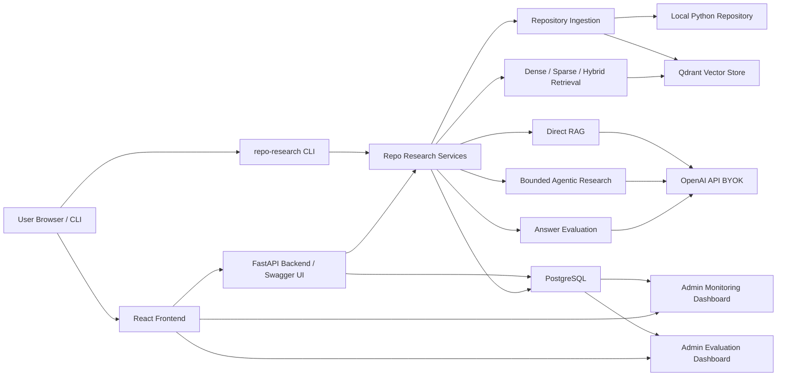

# Architecture

## Local Alpha Stack



The Local Alpha deployment model is local-first: Docker Compose runs Qdrant,
PostgreSQL, the FastAPI backend, and the React frontend on the user's machine.
Live answer generation and judging use the user's own OpenAI API key.

## Working Layers

```text
Makefile
  Small operator shortcuts for checks, services, ingestion, RAG, evaluation,
  and local app startup.

Entry points
  repo-research CLI for local commands.
  FastAPI for browser and HTTP clients.
  React TypeScript frontend under frontend/.

Runtime composition
  runtime.py creates shared database, model, RAG, research-agent, and
  recording-store dependencies.

Service layer
  rag.py        runs direct RAG, citation validation, and answer evaluation.
  research.py   runs bounded agentic research with PydanticAI and typed tools.

Retrieval and storage
  qdrant_store.py  owns FastEmbed, Qdrant payloads, and dense/sparse/hybrid search.

Persistence
  recording_store.py  persists run telemetry, feedback, answer snapshots, and
  evaluation rows in PostgreSQL.

Ingestion
  ingestion.py  discovers files, records Git identity, filters, and parses.

Observability
  monitoring.py   optional Logfire instrumentation for FastAPI and PydanticAI.
  telemetry.py    application telemetry helpers.
  pricing.py      OpenAI cost estimation separate from answer generation.
```

`make rag` and `POST /rag` reach the same `DirectRagService` through the same
runtime composition module. `make research` and `POST /research` reach the same
`BoundedResearchService` with configurable tool-call budgets for searches, file
reads, and total calls.

## API Surface

```text
GET  /            Redirect to Swagger UI at /docs
GET  /docs        Swagger UI for the FastAPI contract
GET  /openapi.json  Runtime OpenAPI JSON
GET  /health      Qdrant dependency health
POST /repositories/ingest   Parse and index a repository
POST /rag         Direct RAG answer with trace metadata
POST /research    Bounded agentic research with trace metadata
POST /feedback    Persist useful/not-useful feedback linked by session_id
GET  /monitoring/summary    Aggregate admin dashboard data from PostgreSQL
GET  /monitoring/runs       Recent persisted run rows
GET  /monitoring/runs/{request_id}  One persisted run detail
GET  /evaluations/summary   Aggregate admin evaluation data from PostgreSQL
GET  /evaluations/runs      Recent persisted evaluation runs
GET  /evaluations/results   Recent persisted evaluation result rows
```

## Data Flow

```text
Local repository path or GitHub URL
        |
        v
ingestion.py -- filters, Git identity, and parsing
        |
        v
qdrant_store.py -- FastEmbed, current chunk payloads, vector search
        |
        v
rag.py / research.py -- direct RAG or bounded agentic research
        |
        v
recording_store.py -- persist run data, feedback, snapshots, evaluations
        |
        v
repo-research CLI / FastAPI -- JSON evidence and grounded answers
        |
        v
frontend/ -- browser research UI, feedback, and admin monitoring dashboard
```

Ingestion is request-driven because the repository is selected by the user at
runtime. The application-owned Python lifecycle is:
repository selection -> local access or GitHub clone -> parse -> chunk -> embed
-> Qdrant index. This keeps Local Alpha simple and reproducible without adding
Kestra, dlt, Airflow, Prefect, or another orchestration framework solely for
batch scheduling.

`ParsedChunk` is the boundary between parsing and storage. It carries repository
and commit identity, path, symbol, parent symbol, line range, content,
contextual metadata, and deterministic content/point IDs. Qdrant persists that
payload, allowing search and answers to return evidence rather than only text
snippets.

Each indexed chunk becomes one Qdrant point:

- Point ID: the deterministic chunk ID.
- Payload: the full `ParsedChunk` JSON, including the chunk text in `content`
  plus repository, commit, path, symbol, line range, chunk type, and metadata.
- Dense vector: a named `dense` vector generated from `ParsedChunk.content` by
  the configured FastEmbed dense model and compared with cosine distance.
- Sparse vector: a named `sparse` vector generated from the same
  `ParsedChunk.content` by the configured FastEmbed sparse encoder.

The source text is therefore not stored "inside" the vector. Qdrant stores the
text as point payload so the application can reconstruct evidence, and stores
the dense and sparse vectors beside that payload so queries can rank matching
chunks. Dense search embeds the query and searches the `dense` vector; sparse
search encodes the query and searches the `sparse` vector; hybrid search asks
Qdrant to combine bounded dense and sparse candidates with Reciprocal Rank
Fusion.

`RepositoryDatabase` stages replacements by validating dense and sparse
embeddings and upserting named `dense`/`sparse` vectors before deleting stale
point IDs. This retains the previous searchable index if validation or upsert
fails. Search is scoped to both repository and commit identity. Dense and sparse
queries return the same typed shape; hybrid search uses Qdrant Reciprocal Rank
Fusion over bounded candidates.

`ingestion.py` reports decoding, filesystem, and syntax failures for eligible
files without discarding successfully parsed chunks. The CLI emits those
diagnostics alongside repository identity and indexed-chunk count.

`evaluation.py` loads versioned JSON ground truth, runs every baseline retrieval
mode, and writes deterministic file- and symbol-level metric reports.
`answer_evaluation.py` evaluates generated or previously recorded answers and
can persist judge results to PostgreSQL.

`rag.py` preserves the result order returned by the selected retrieval mode,
assigns opaque evidence IDs to retrieved chunks, asks the answer model to cite
only those IDs, then maps valid IDs back to canonical paths, symbols, and line
ranges. Unknown citations or empty retrieval results return explicit
insufficient-evidence answers. RAG runs return `RagRunResult`, keeping
model-authored answer content under `answer` and application-owned telemetry
under `trace`.

`research.py` runs bounded agentic research using PydanticAI. The
`BoundedResearchService` enforces configurable limits on search calls, file
reads, and total tool calls. Tools include `search_repository`, `read_chunk`,
`read_file`, and `find_symbol`. The agent produces structured change-impact
output grounded in retrieved or read repository evidence.

`recording_store.py` persists run summaries, feedback events, answer snapshots,
evaluation runs, and evaluation results in PostgreSQL. `NoOpRecordingStore` is
used when PostgreSQL is not configured.

`monitoring.py` provides optional Logfire instrumentation for FastAPI and
PydanticAI. It complements PostgreSQL-backed monitoring rather than replacing
persisted application data.

`frontend/` is a React TypeScript app using TanStack Router and Query. It is a
client of the FastAPI contract: it submits question mode, retrieval mode, limit,
research kind, and session ID, then renders answers, evidence, trace metadata,
model usage, cost telemetry, research steps, and change targets. The monitoring
and evaluations routes are local admin/operator surfaces: they render
PostgreSQL-backed run history, scoped summary cards, chart panels, evaluation
results, and selected run detail for the person running the stack.

`pricing.py` keeps OpenAI cost estimation separate from answer generation.
Unknown model prices, explicit empty pricing overrides, and inconsistent
provider usage metadata produce unknown cost fields rather than failing the RAG
run.

## Docker Compose Services

```text
qdrant       Qdrant v1.15.1 vector database
postgres     PostgreSQL 17 for persisted application data
api          FastAPI backend (Python 3.12, uv)
frontend     React TypeScript frontend (Node 22, Vite)
```

All services have health checks. The API depends on healthy Qdrant and
PostgreSQL; the frontend depends on a healthy API.

FastEmbed models are cached outside source-controlled files. Local CLI runs can
set `RDR_FASTEMBED_CACHE_PATH`; `.env.example` uses `.cache/fastembed`, while an
unset app setting lets FastEmbed reuse its own `FASTEMBED_CACHE_PATH` or
`/tmp/fastembed_cache` fallback. Docker Compose sets the API cache to
`/root/.cache/fastembed` and persists it in the `fastembed_cache` volume so
container restarts do not redownload the model. When the selected cache already
has files, the embedder tries FastEmbed local-files-only loading before falling
back to normal download behavior.
